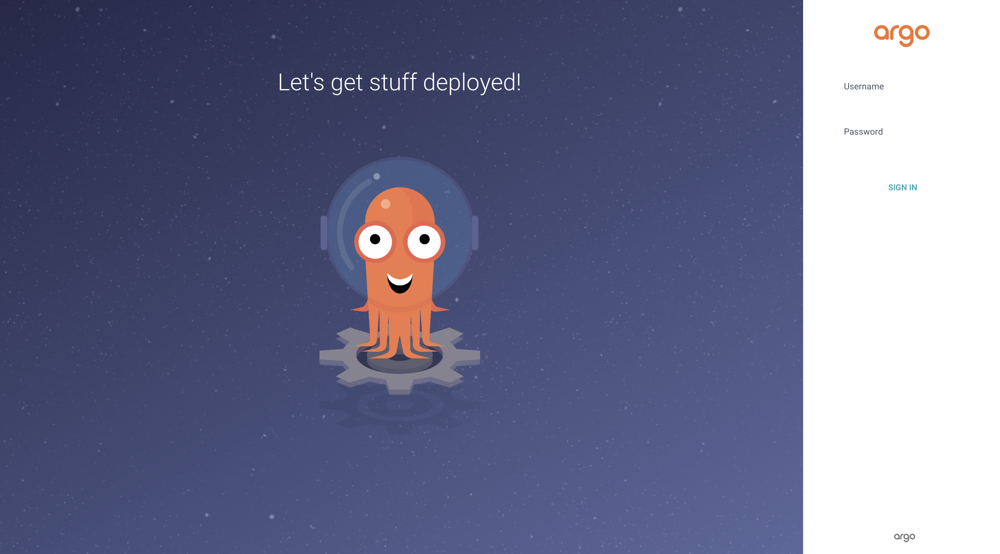

# Basic App

- created a basic express API that returns `Hello World`, running on port 3000
- added a Docker file, that relies on Node base image and exposes port 3000

# Image buid/test locally

- `cd SomeTestAPI`
- `docker build -t sometestapi .`
- `docker run -d -p 3000:3000 sometestapi`

# Deploying to Docker Hub

- `docker login`
- `docker tag sometestapi aimalkhan26/sometesapi:latest`
- `docker push aimalkhan26/sometesapi:latest`
- `docker pull aimalkhan26/sometesapi:latest`
- `docker run -d -p 3000:3000 aimalkhan26/sometesapi:latest`

# Kubernetes Setup

Instead of deploying the test express server, my next steps are to deploy an Argo CD instance which then connects to the Public SomeTestAPI Repo and deploys it to my local K8s instance:

- started by installing a k8s instance locally via `brew install minikube` and then `minikube start`
- run `kubectl get all` to make the cluster's up and running (verified!)

# Deploying SomeTestAPI via a deployment file
- `kubectl apply -f sometest-api-deployment.yaml`
- `minikube service sometestapi-server --url` (this will give you the url for base endpoint)
- navigate to `http://127.0.0.1:51259/`

# Viewing Logs
- `kubectl get pod`
- `kubectl logs sometestapi-server-b8d4bfc47-zk7zp -f`

# Testing Argo CD Deployment (IN PROGRESS....)
- following the instructions here: https://argo-cd.readthedocs.io/en/stable/getting_started/
- before we deploy the argo-cd instance, create a new namespace for it to keep it separate from default stuff on the cluster by running `kubectl create namespace argocd`
- applying it to the cluster via `kubectl apply -n argocd -f https://raw.githubusercontent.com/argoproj/argo-cd/stable/manifests/install.yaml`
- `brew install argocd`
- `kubectl patch svc argocd-server -n argocd -p '{"spec": {"type": "LoadBalancer"}}'`
- `kubectl port-forward svc/argocd-server -n argocd 8080:443` (THIS NEEDS TO CONTINUE RUNNING FOR YOU TO ACCESS ARGO CD)
- navigate to `https://localhost:8080/login`
- get initial password using `argocd admin initial-password -n argocd`